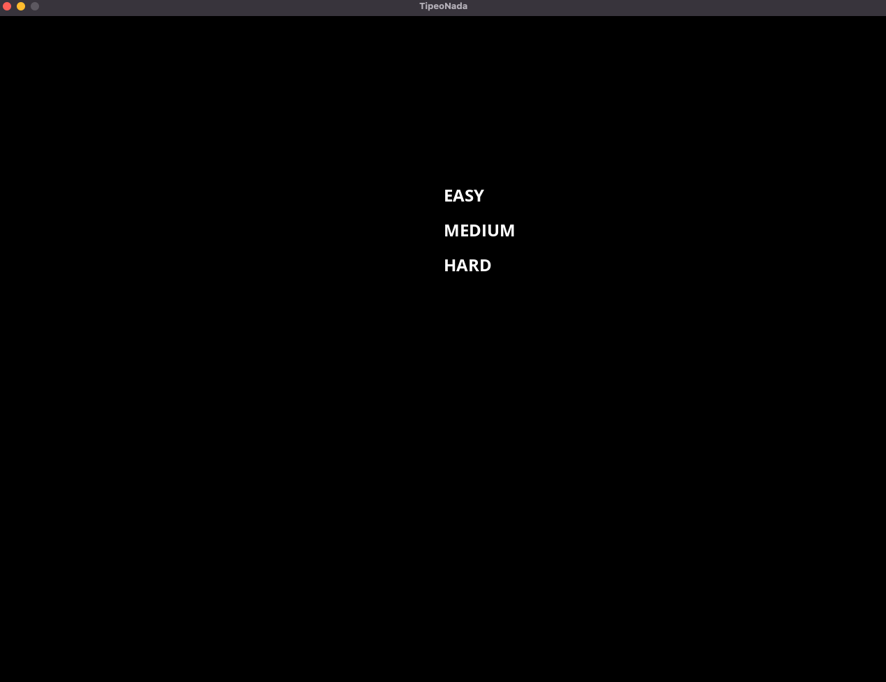
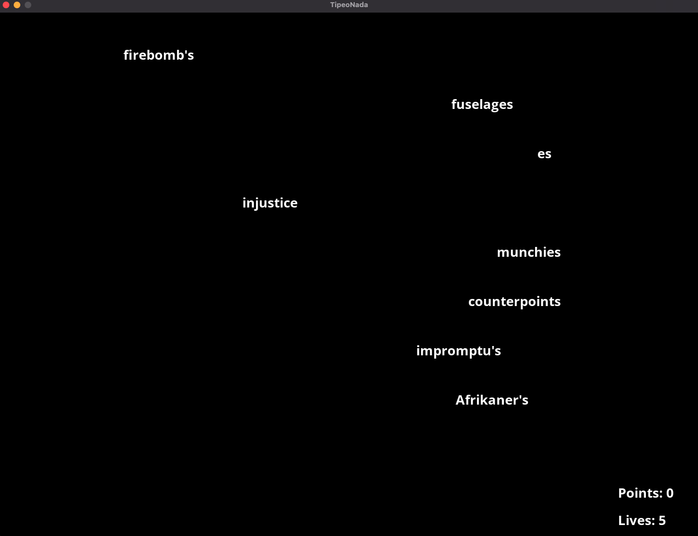

# TipeoNada

##### This is a game in C++ based on the SDL framework to test your typing skills

You can add any word corpus to the game in `src/Assets/words.txt`. You can check the default example using Spanish words.

Some screenshots:

