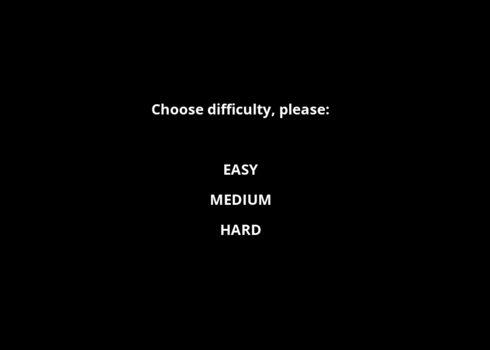

# TipeoNada

#### This is a game in C++ based on the SDL framework to test your typing skills

###### Libraries required to develop

- SDL
- SDL_Mixer
- SDL_Image
- SDL_TTF

This 4 dependencies are added as git submodules so after cloning you should get these 4 under the `external` directory. Remember to initialize the `external` directory by running in the root folder:
```
git submodule init
git submodule update
```

###### For web version

- Emscripten (EMCC)

It uses [Emscripten](https://emscripten.org/) to compile it to an html and play it on the web.

For both versions (web and desktop) [CMake](https://cmake.org/) is used. To build the web version it should be enough to do:

```
emcmake cmake -B build_emscripten
cd build_emscripten
make
```

and for the desktop version:

```
cmake . -B build -DCMAKE_EXPORT_COMPILE_COMMANDS=1
cd build
make
```

##### Troubleshooting
You may have an issue running the first cmake step if CMake does not know where the compiler is. You can also point your compilers with CMake flags, for example:
```
cmake . -B build -DCMAKE_EXPORT_COMPILE_COMMANDS=1 -DCMAKE_C_COMPILER=/Applications/Xcode.app/Contents/Developer/Toolchains/XcodeDefault.xctoolchain/usr/bin/cc -DCMAKE_CXX_COMPILER=/Applications/Xcode.app/Contents/Developer/Toolchains/XcodeDefault.xctoolchain/usr/bin/c++
```

Then you can test it locally by going to `build` directory and running:

```
./bin/TipeoNada
```

---

You can add any word corpus to the game in `src/Assets/words.txt`. Be careful because Emscripten (the web version) doesn't work very well with composite keys (E.G.: è, á, etc.).

You can check it out and play it online [here](https://storage.googleapis.com/tipeo-nada-web/TipeoNadaWeb.html)

Some screenshots:



